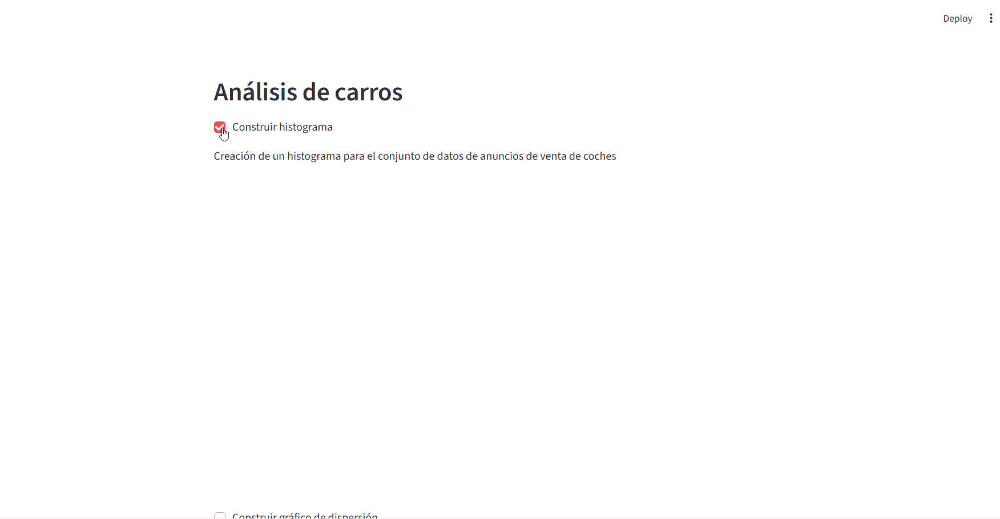

# 🚗 Vehicle Market Insights: Dashboard Interactivo de Análisis de Datos

[](https://tu-link-de-deployment-opcional.com)
[](https://www.python.org/)

## 📌 Visión General del Proyecto
Este proyecto es una aplicación web interactiva diseñada para analizar anuncios de venta de vehículos en EE. UU. El objetivo principal es proporcionar una herramienta de **autoservicio de datos** que permita a compradores y vendedores entender la depreciación de los vehículos y las tendencias del mercado basándose en datos reales.

> **Impacto Profesional:** Este proyecto demuestra un ciclo completo de análisis: desde la limpieza de datos y el análisis exploratorio (EDA) en Jupyter, hasta el despliegue de una solución visual interactiva para usuarios no técnicos.

## 📊 Insights Clave (Hallazgos del Análisis)
A través de este dashboard, se pueden identificar patrones críticos del mercado:
* **Relación Precio-Desgaste:** Mediante análisis de dispersión, se visualiza cómo el kilometraje impacta exponencialmente en el valor de reventa.
* **Segmentación de Inventario:** El histograma permite identificar los rangos de kilometraje donde se concentra la mayor oferta, facilitando la detección de inventario "joven" vs. "veterano".
* **Detección de Outliers:** Identificación visual de vehículos con precios inusuales respecto a su año y kilometraje.

## 📈 Funcionalidades de la Aplicación
La interfaz permite una exploración dinámica mediante:
1. **Histograma Interactivo:** Visualiza la frecuencia de vehículos por kilometraje (odómetro).
2. **Gráfico de Dispersión:** Analiza la correlación entre precio y kilometraje.
3. **Control de Visualización:** Botones de acción y checkboxes que permiten generar gráficos bajo demanda, optimizando la experiencia de usuario y el rendimiento de la app.

## ✨ Demostración Interactiva

*Explora cómo los filtros dinámicos revelan insights del mercado automotriz.*

## 🛠️ Stack Tecnológico
* **Lenguaje:** Python 3.12
* **Análisis de Datos:** Pandas, NumPy
* **Visualización:** Plotly Express (Gráficos interactivos)
* **Despliegue/Web:** Streamlit
* **Entorno:** Jupyter Notebooks (EDA inicial), Git para control de versiones.

## 📂 Estructura del Repositorio
* `app.py`: Archivo principal de la aplicación Streamlit.
* `notebooks/EDA.ipynb`: Cuaderno con el análisis exploratorio y limpieza de datos previa.
* `vehicles_us.csv`: Conjunto de datos de anuncios de vehículos.
* `requirements.txt`: Lista de dependencias para asegurar la reproducibilidad.

## 🚀 Instalación y Ejecución
Para replicar este análisis localmente:

1. **Clonar el repositorio:**
   ```bash
   git clone [https://github.com/ArthurSmith25/Vehicles-data-analysis-streamlit.git](https://github.com/ArthurSmith25/Vehicles-data-analysis-streamlit.git)
